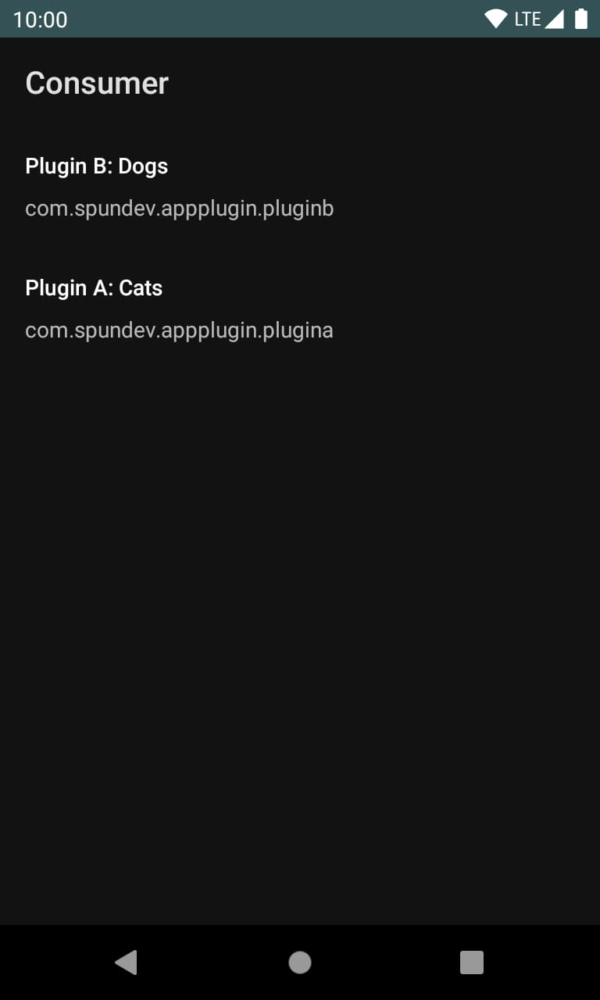
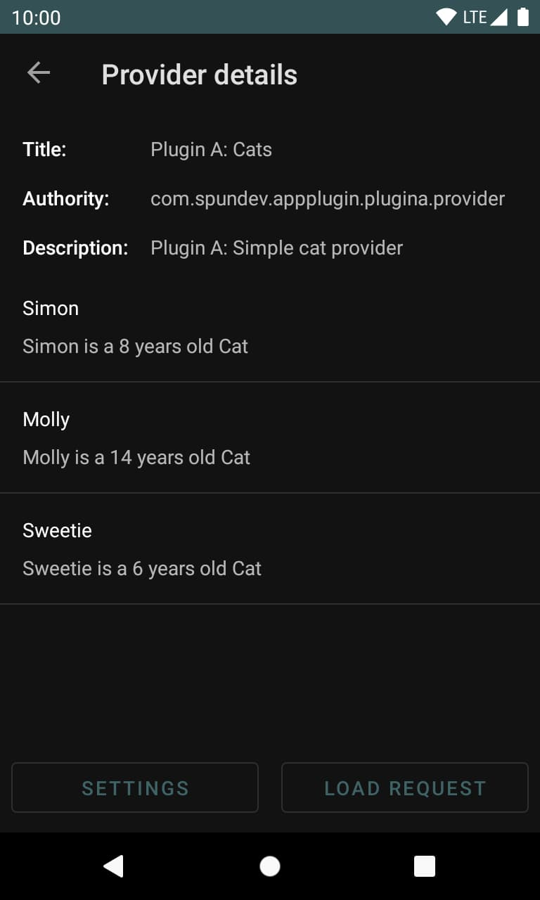
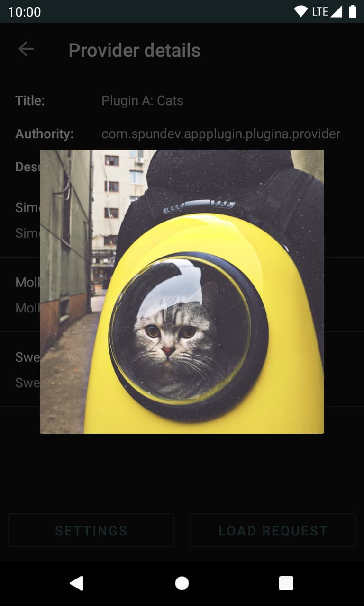
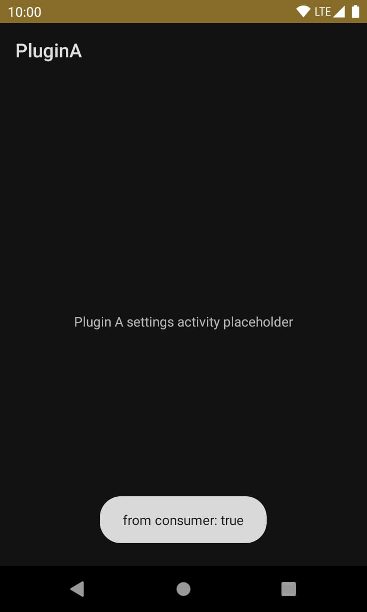

# About

*This project is part of a series of small and quick projects created to have some code references for future creations. Be aware, these projects are not focused on best practices, testing or code quality in general, their purpose is to be the first steps to a more solid implementation.*

This repository contains a group of Android applications that make use of content providers to extend the capabilities of a "Consumer" main application using external "plugin" apps.

The consumer is able to find all the installed plugin apps using Android's Intent mechanism. Once discovered, the consumer app is able to query and make calls to the plugin's content provider.

Each plugin has to declare and implement its own content provider using some agreed formats and values. To simplify the creation of a plugin app, the folder `PluginApi` can be used as a module inside the plugin project. For more information on how to create a plugin app, check the [README](./PluginApi/README.md) file inside the `PluginApi` folder.

The implementation of this consumer + plugins projects is based on [Muzei Live Wallpaper](https://github.com/romannurik/muzei) api. This simplified version is only intended to be an introduction to this idea. For a complete implementation, please visit Muzei's repository.

## What does this project use

What can this project offer as a reference for the future?

- [x] Content providers
  - [x] Create provider using room db (partial)
  - [x] Query from other app (exported, permissions)
- [x] PackageManager

## How to run

1) Open `PluginA` and `PluginB` projects in AndroidStudio and run the applications.
2) Open `Consumer` project in AndroidStudio and run the application.

The Consumer app will show all the available plugins installed on the device. If one is selected, the consumer app will show some extra information and the content that the plugin is offering,

## Screenshots

## Sources

- [Muzei Live Wallpaper](https://github.com/romannurik/muzei)
- [Muzei 3.0 and the new API](https://medium.com/muzei/muzei-3-0-and-the-new-api-4fd3d6133db6)
- [Room with Content Providers Sample](https://github.com/android/architecture-components-samples/tree/main/PersistenceContentProviderSample)

---

- App icons from [Twemoji](https://twemoji.twitter.com/ "Twemoji") licensed under [CC-BY 4.0](https://creativecommons.org/licenses/by/4.0/ "CC-BY 4.0")  
- Pet images from [Unsplash](https://unsplash.com/ "Unsplash") - [(License)](https://unsplash.com/license "License")